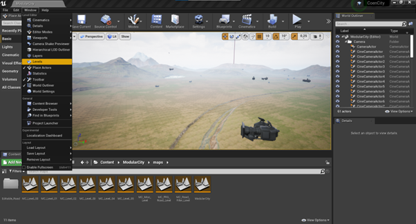

# Data gathering from Unreal Engine 4


This work provides the Python tools for the generation of drone sensor data under actuator faults using the AirSim simulator 
within Unreal Engine 4 as proposed in the paper: "Unreal Success: Vision-Based UAV Fault Detection and Diagnosis Frame".
This entails all the commands that interact with the UE4 environment for the generation of the occupancy map, 
drone navigation and drone flight, as well as the failure injection and the data collection.

The repository contains Python code for:
- the generation of an occupancy of the UE4 environment
- path planning in the occupancy map
- flight execution
- in-flight failure injection
- data collection and dataset generation
- scoping tool for debugging

## Motivation
For the development and performance assessment of vision-based FDD algorithms, it is required to have a dataset
which includes IMU and camera output in nominal flight and in failure scenarios. Unfortunately, the current available
datasets do not include IMU sensor information, such as the [VisDrone dataset](https://github.com/VisDrone/VisDrone-Dataset)
or the [Indoor Navigation UAV Dataset](https://www.imperial.ac.uk/intelligent-digital-systems/indoor-uav-data/)
, and do not have any recorded scenarios with failures, such as the 
[UZH-FPV Drone Racing Dataset](https://fpv.ifi.uzh.ch/) or
the [Zurich Urban Micro Aerial Vehicle Dataset](https://rpg.ifi.uzh.ch/zurichmavdataset.html).

Gathering large quantities of data for knowledge-based fault detection models with an UAV is very time consuming,
dangerous and expensive; data would have to be annotated, multiple failure modes would have to be induced in the
vehicle and the flight environment, as well as the UAV, would have to be adapted to minimise the potential risk. Besides
that, in an experimental physical setting it is very difficult to collect data from various environments and conditions. A
suitable alternative is the simulation of the vehicle in a realistic environment, the storage of the sensor synthetic data for
model training and the transfer learning to the real world UAV. It has been observed that the addition of large quantities
of synthetic data to a smaller real dataset would lead to a performance increment when compared to the scenario in
which only real data is collected ([hybrid dataset](https://arxiv.org/abs/1709.07857)).

This work presents UUFOSim (Unreal UAV Failure injectiOn Simulator), a data gathering pipeline
built on AirSim for the collection of synthetic flight data with actuator failures in a urban environment.
The potential of UUFOSim has been demonstrated for the Parrot Bebop® 2 UAV. Its aerodynamic model is available
from [literature](https://ieeexplore.ieee.org/document/8764021) and it has been complemented with the blade damage model from the author's paper: 
"Blade Element Theory Model for UAV Blade Damage Simulation".


## Code structure
The project contains the following files:

GENERAL FILES
* *\_\_init\_\_.py*: Provides the main file that the user should run in order to interact with Unreal Engine 4 and collect flight data. 
The user should already be running Unreal Engine 4 in the background.

* *\_init\_paths.py*: Provides the function that adds some folders to the path.

* *user_input.py*: Provides all the user inputs, except data file paths, centralised in a single file

* *user_input_file_loc.py*: Provides the file path to directories where data could be found or stored.
It should be modified by the user to the right file paths before use.

* *verify_user_input.py*: Provides a function that checks for obvious potential mistakes provided by the user in the 
input files.

* *\_init\_json\_config.py*: Provides the function that returns the location of the AirSim json settings file.

* *utils.py*: Provides the function that help in the transformation of the UE4 point cloud into an occupancy map and the processing of
data pulled from the simulation.

* *compute_sample_rate.py*: Provides a boxplot showing the spread of the camera and IMU sampling rates for different 
simulation clockspeeds. This information is later used to select the right simulation clockspeed for data collection.

* *Plotter3D.py*: Provides the tools to represent the occupancy map and the vehicle trajectories in an interactive 3D environment.

* *ScopePlotting.py*: Provides the procedural code in order to scope any signals given a specific command to the drone.
It is used to easily visualize the functionality of the scoping function and for debugging purposes.

* *Airsim_lib_mod*: Folder containing the modified files of the AirSim library. The user needs to replace the 
default AirSim library files by the ones provided here. All the files are included in the folder for 
easing the copy-paste process. However, the file that needs MUST be copied is the *client.py*. 
Multiple functions were added that enable the rest of the code to interact with the UE4 simulator. 

ENVIRONMENT EXTRACTION AND MANIPULATION (within the Environment_extraction folder)
* *OccupancyMap.py*: Provides the OccupancyMap class in charge of building, manipulating and visualizing the occupancy map used for the
navigation of the vehicle in the UE4 environment without colliding with obstacles.

VEHICLE NAVIGATION (within the Drone_grid_navigation folder)
* *GridNavigation.py*: Provides the tools to compute the trajectory that the drone should follow in the occupancy map in order to reach its
destination from a provided initial point while avoiding the obstacles.

* *Path_planning_comparison.py*: Provides the code for the generation of histograms that allow the comparison of the computational performance of the
different navigation approaches considered. With computational performance it is referred to computational time.

* *PythonRobotics*: Folder containing the robot navigation library from [PythonRobotics](https://github.com/AtsushiSakai/PythonRobotics/tree/master).
Unfortunately, multiple files from this public navigation library had to be modified because they were either faulty or
they require some adaptation for the problem at hand. As a result, the library has been downloaded and added to this
repo instead of forking it or cloning it. Also, all the files were included because the imported files below have
multiple dependencies spread through the rest of the library files.

INJECTION OF FAILURES (within the Drone_flight/Failure_injection folder)
* *FailureFactory.py*: Provides the FailureFactory object which creates and administers the failure types desired to be injected in the vehicle
during flight by the user for the generation of the dataset. The failure factory creates the pool of potential failures that could be injected during the flight given the user
input and, for every run, it randomly selects and executes one of those failures. It also stores all the failure
information in the Flight_info file for later analysis and creating the labels required for training any FDD approach.

* *FailureTypes/ActuatorFailureBase.py*: Provides the base class that contains the general methods for actuator failures.

* *FailureTypes/ActuatorLocked.py*: Provides the class that emulates the behaviour of a locked propeller.

* *FailureTypes/ActuatorSaturation.py*: Provides the class that emulates the behaviour of a saturated propeller.

* *FailureTypes/PropDamage.py*: Provides the class that emulates the behaviour of a damaged propeller.

* *FailureTypes/PropDamageAdvancedSingleBlade.py*: Provides the class that emulates the behaviour of a damaged propeller 
using the Blade Element Theory model presented in the paper: "Blade Element Theory Model for UAV Blade Damage Simulation"

* *FailureTypes/PropFlyOff.py*: Provides the class that emulates the behaviour of a propeller that has flown off.

EXECUTION VEHICLE FLIGHT (within the Drone_flight folder)
* *Data_gathering/DataGathering.py*: Provides the DataGathering object which collects flight and sensor data from a user-defined number of runs.

* *Data_gathering/MultiThreadDataGathering.py*: Provides the code to run multiple drone agents collecting data (threads) simultaneously within the same simulation
environment. ** EXPERIMENTAL **

* *Data_gathering/DroneCamera.py*: Provides the DroneCamera class that provides all the functions desired from an AirSim camera object, such as the
capturing of images and their structured storage for dataset build-up.

* *Data_gathering/DroneSensors.py*: Provides the DroneSensors class that manages all the actions of the sensors, namely their initialization, activation and
data storage, as well as their reinitialization for a new flight.

* *DroneFlight.py*: Provides the DroneFlight class which carries out the complete flight for a single drone.
It performs from the generation of the map with OccupancyMap, to the obstacle avoidance with GridNavigation, to the
collection of data with DroneSensors. It incorporates all the methods in order to make a single flight successful.

* *ControllerTuning.py*: Provides the tool to scope vehicle signals and computes the position error of the vehicle for its PID controller tuning.
It create a functionality similar to the scoping function within Matlab in which the user can see at the end of the
simulation the resulting signals for position, velocity, acceleration, etc.

To start using the code you can download the required Python libraries stored within _requirements.txt_. For that purpose,
it is as simple as running the following command within the command line:
```shell script
pip install -r requirements.txt
```
Then adjust the parameters that you deem necessary in _user\_input.py_ and 
_user\_input\_file\_loc.py_, and run __init__.py_.

You can also run it within Google Colab. For that you only copy-paste two lines. First:
```shell script
!git clone https://github.com/joigalcar3/DataGatheringUE4
```
This will clone the repository. Then you can open the _user\_input.py_ and 
_user\_input\_file\_loc.py_ files and alter the user input. When altering the _user\_input\_file\_loc.py_
file, you need to provide the path to certain directories. Since those directories do not exist by
default, please create them. Second, run:
```shell script
!python DataGatheringUE4/__init__.py
```

## Implementation, results and conclusions
The results of this work can be found in the author's Master thesis and paper:

1. Master thesis: "From Data to Prediction: Vision-Based UAV Fault Detection and Diagnosis". Chapters 8.
2. Paper: "Unreal Success: Vision-Based UAV Fault Detection and Diagnosis Frame". Section III and section V.A.. 

These documents explain:
* Environment and occupancy map extraction explanation
* Detailed path planning explanation
* Data collection pipeline explanation
* Clock speed selection discussion
* Debugging tool for signal scoping description
* Description of the collected dataset


## Installation steps

4 software components are required for set-up of the fault detection and identification simulation framework

* Unreal Engine 4
* AirSim
* C++ APIs
* Python APIs

With this instruction manual you should have access to:
* Dedicated AirSim copy with the physics engine of Bebop 2 and the INDI controller. 
For that, please contact José Ignacio ([j.i.dealvearcardenas@student.tudelft.nl](mailto:j.i.dealvearcardenas@student.tudelft.nl)), 
who can provide you with a copy. In the future this software will be available in GitHub.
* Coen de Visser login details for Unreal Engine. For that purpose, 
please contact Coen de Visser ([c.c.devisser@tudelft.nl](mailto:c.c.devisser@tudelft.nl)).

Next, the installation and set-up steps for each of the aforementioned software components will be explained.

### Python and C++ APIs

1. Download [Anaconda](https://www.anaconda.com/) in order to obtain Python and easy access to all scientific libraries.
2. Download [Pycharm (Professional)](https://www.jetbrains.com/pycharm/) as an IDE for Python.
3. Create a Conda environment with Python 3.7.
4. Install the libraries from *AirSim/PythonClient/multirotor/Occupancy_grid/requirements.txt*.
5. Go to ...\anaconda3\envs\NameCondaEnvironment\Lib\site-packages\airsim and substitute the files there
(at least client.py) with the files stored in *AirSim/PythonClient/multirotor/Occupancy_grid/Airsim_lib_mod*. 
NameCondaEnvironment is the name that you gave to your conda environment.
6. Download [Microsoft Visual Studio Community 2019](https://visualstudio.microsoft.com/vs/older-downloads/) (versions 16.9 or 16.11) as IDE for C++.


### Unreal Engine 4 and AirSim

1. Download the [Unreal Engine Launcher](https://www.unrealengine.com/en-US/download) in order to be able to install the UE4 engine and all the required assets.
2. Open the Unreal Engine Launcher with the login details of Coen de Visser.
3. Download Unreal Engine 4.25.4 by clicking in the plus button as pointed in the image below.


4. Open a clean empty project by clicking on the 4.25.4 UE4 engine launch, as shown in the image below. 


5. Select "*Games*" project category. Leave it as a "*Blank*" Blueprint project, available for Desktop/Console and maximum quality. 
The only setting you need to change is that you do not want it “*With Starter Content*”, 
so change this option to "*No Starter Content*". Select where you want to save this new project and give it a sensible 
and memorable name. All the settings can be observed in the next image.


6. Add the Next Gen Modular City V3 environment to the new project you created from the Unreal Engine Launcher 
by clicking in “Add to Project”, as shown in the image below. Select the project you just created.


7. Follow the steps in ["Creating and Setting Up Unreal Environment"](https://microsoft.github.io/AirSim/unreal_custenv/) from the AirSim documentation, 
using the project you created instead of LandscapeMountains, so you can skip steps 1 and 2. 
If you have already opened your new project in UE4, then you can also skip step 3. In step 5, 
it suggests copying the Unreal/Plugins folder into your new environment folder.
Instead, we copy the *Airsim/Unreal/Environments/Blocks/Plugins* folder, 
since it has the built modified AirSim version we want to use. At the end of this step, you should
have the City environment opened from the C++, not from the UE4 launcher.
 
8. In the UE4 editor you should see the “*ModularCity*” folder in the Content Browser tab, as in the image below. 
Open “*Content/ModularCity/maps/ModularCity*” by double clicking on the corresponding icon. Then you will see the loaded
landscape without any building or roads assets.


9. When you load the "*ModularCity*" landscape, it looks as if the lights are switched off. To solve this problem, go to 
the World Outliner in the top right corner and look for "PostProcessVolumeSky". Then, go to the Details tab located
at the bottom right and search for "Exposure Compensation" in the search tab and tick off this option. Then the
lights will be switched on.

11. Once the ModularCity basic map has loaded, you can load the buildings and roads by loading the 
different levels. In order to see the levels, you can click on Levels within the Window tab next to the
Edit Tab. Then you can load each of the levels one by one by right clicking on each one and selecting
 “Load”. 




<!---"MC_PRG_Road_Level" is the most computationally expensive level since it is composed of roads created 
 with the Procedural Road Generator (PRG). Hence, instead of being static meshes, they are actors that can be modified.
This possibility of modifying the object slows down the simulation. This can be solved by selecting multiple roads,
right on one of the selected roads and clicking on merge actors. By lumping multiple roads into a single object,
the draw calls to the same material (for instance, the asphalt colour) is reduced from the x number of selected
roads to 1.-->

"MC_PRG_Road_Level" is the most computationally expensive level since it is composed of roads created 
 with the Procedural Road Generator (PRG). Hence, instead of being static meshes, they are actors that can be modified.
This possibility of modifying the object slows down the simulation. This can be solved by moving the PRG level
one folder up such that the world composition does not take it into account. However, you must copy the cross-road
objects from the PRG level to the editable road level, since they do not exist in the second one. The editable road level can be made
more efficient by merging spline meshes actors (not static meshes). The static mesh actors could be merged using the 
batch merging, which will turn them into instanced static meshes that is ultra performant when using the
nanites rendering technology of UE5. 

Additionally, it might be the case that you do not want to have the complete city environment for the FDD
simulation, since part of the FDD pipeline is to retrieve the meshes from UE4 in order to create the 
occupancy map. Having many actors may cause the FDD to crash depending on your machine (laptop/PC) specs. Hence,
you can also move one folder up all those levels that you do not require to use (for instance levels 0, 1, 3, 4, 5)
and you can delete or hide the unnecessary roads from the editable road level.

Such process of merging roads can take up to a day of (monotonous) work. In order to avoid wasting your time, contact
José Ignacio ([j.i.dealvearcardenas@student.tudelft.nl](mailto:j.i.dealvearcardenas@student.tudelft.nl)) who
has already suffered this process and has merged all the PRG roads in order to have smooth simulations. He
could provide you with the modified City environment.

10. Now that you have a working environment launched from C++, you can click "Play" in order to launch the simulation, 
as shown in the image below. Then you should see a drone hovering.


11. If you want to launch the data collection, first check whether the settings in user_input.py and user_input_file_loc.py
suit you. The definition of each of the inputs can be read in the files. Once you are ready, run \_\_init__.py.

## Notes
The Bebop 2 drone has a camera that takes images at 30fps and it has an IMU that operates at 512 Hz. In order to run
the simulation with data collection at similar rates the following __clockspeed__ needs to be set up depending on the 
resolution of the images saved:

* If the images collected have dimensions equal to 256x144 (widthxheight), then the clockspeed needs to be 0.7. 
The two figures below shows the sampling rate of the camera and the IMU for different clockspeeds for 20 flights each. 
The clockspeeds of 0.6, 0.7, 0.8, 0.9 and 1 are the closest to 30 fps, but the last 3 clockspeeds show IMU sampling 
rates which are very far from the desired  512 Hz, namely 416 Hz, 370 Hz and 334 Hz. Between clockspeeds 0.6 and 0.7, 
0.6 is closer to 30 fps by 0.7 fps and both are almost the same distance from 512 Hz for the IMU sampling rate.
Despite 0.6 clockspeed leading to a camera sampling rate closer to the desired value, 0.7 is chosen due to the small 
difference between both clockspeeds and because a clockspeed of 0.7 gathers data 1.17 times faster than a clockspeed of
0.6. As a result, choosing a clockspeed of 0.7, the camera is collecting images at 31.33 fps and the imu at 476.6 Hz.
The _sample_rates_ of the camera and the imu in the _user_input_ file need to be set up higher than these values 
(camera:32, imu:700).


3,598 flights were flown with a clockspeed of 0.7 and image size 256x144 for the creation of the dataset. To verify that 
the camera and IMU sampling rate predictions estimated with 20 flights were accurate, the same box plot was created with
the flown 3,598 flights. The results are shown in the images below: the camera runs at 31.33 fps and the IMU has a sampling
rate of 476.28 Hz. Hence, the camera and IMU sampling rate estimations are very reliable.


* If the images collected have dimensions equal to 512x288 (widthxheight), then the clockspeed needs to be 0.6. 
The two figures below shows the sampling rate of the camera and the IMU for different clockspeeds for 20 flights each. The clockspeeds of
0.6 and 0.7 are the closest to 30 fps, but the 0.6 clockspeed shows the lowest number of outliers.
As a result, the camera is collecting images at 32 fps and the imu at 555.81 Hz. The _sample_rates_ of the camera 
and the imu in the _user_input_ file need to be set up higher than these values (camera:35, imu:700).


5,000 flights were flown with a clockspeed of 0.6 and image size 512x288 for the creation of the dataset. To verify that 
the camera and IMU sampling rate predictions estimated with 20 flights were accurate, the same box plot was created with
the flown 5,000 flights. The results are shown in the images below: the camera runs at 34 fps and the IMU has a sampling
rate of 555.68 Hz. Hence, the actual camera sampling rate is higher than the estimation by 2 fps, whereas the IMU 
estimation is very reliable.


* If the images collected have dimensions equal to 1024x576 (widthxheight), then the clockspeed needs to be 0.3. 
The two figures below shows the sampling rate of the camera and the IMU for different clockspeeds for 20 flights each. The clockspeeds of
0.2,0.3 and 0.4 are the closest to 30 fps, but the 0.4 clockspeed has a IMU sampling rate far from the desired 512 Hz.
Also, 0.2 and 0.3 have a similar camera sampling rate, but 0.3 runs 1.5 times faster than 0.2; hence, it is the chosen one.
As a result, the camera is collecting images at 31.6 fps and the imu at 555.62 Hz. The _sample_rates_ of the camera 
and the imu in the _user_input_ file need to be set up higher than these values (camera:35, imu:700).


The slower the clockspeed of the simulator, the more granular will be the measurements taken from the camera of the 
sensors, meaning that the time difference between measurement and measurement will be smaller. As a result, there 
are higher chances that the actual sampling rate equals the desired sample rate. The larger the clock speed, the larger 
the time between the measurements and the lower the actual sampling rate.

Additionally, in order to increase the sampling rate, it is possible to set up the _ViewMode_ in the settings file to 
_"NoDisplay"_ such that the rendering to the main screen is frozen whereas the recording by the APIs remain active.
As a result, resources are freed for getting images, increasing the sampling rate.

Unfortunately, the sampling rate of each of the sensors is not as granular as desired. For instance, if with a certain 
clockspeed the maximum IMU achievable sampling rate by the simulation is 330 Hz, then the other sampling rates that
could be used are obtained by dividing this number (the maximum achievable sampling rate of the sensor with a certain 
clockspeed) by integers. As a result, the sampling rates that one could choose for this example are 330 Hz,
165 Hz, 110 Hz, 82.5 Hz, 66.55 Hz, 55 Hz, 47.14 Hz, 41.25 Hz, 36.66 Hz.


## Credits
The path planning algorithms (PythonRobotics/PathPlanning) have been obtained from the PythonRobotics
library of [Atsushi Sakai](https://github.com/AtsushiSakai/PythonRobotics). Multiple modifications have been 
made to the original library in order to be compatible with the software architecture created for this project.


## Contact
Hope you enjoy the code!! For any questions, comments or suggestions, 
please reach out to me at [jialvear@hotmail.com](jialvear@hotmail.com).


    @inproceedings{dealvear2024UE4,
      title={Unreal Success: Vision-Based UAV Fault Detection and Diagnosis Framework},
      author={de Alvear Cárdenas, J.I. and de Visser, C.},
      booktitle={AIAA Scitech 2024 Forum},
      year={2024}
    }